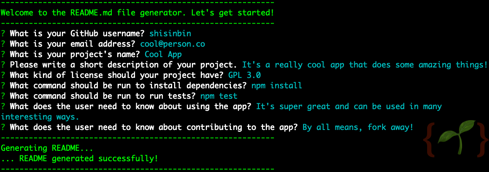

# README Generator

 

## Description

A simple command-line application that helps a user to generate a basic README.md file for their GitHub repository. The app uses Node.js and the Inquirer package to prompt the user for various information before using it to generate a README.md file.

This app was developed to improve my knowledge and understanding of using Node.js - its modular functionality and the built-in library `fs` to help read from and write to files - as well as how other packages that provide some cool piece of functionality can be easily imported and used.

## Getting Started

First of all, you need to make sure you have [Node.js](https://nodejs.org/en/download/) installed in your system. To check that it is installed, in a terminal put in the following: `node -v`. If it is, you should get output telling you which version is running (for what it's worth, this app was built with Node.js version v16.19.0).

If you're in the app for the first time (after downloading this repo) then go to the readme-generator folder in the terminal and run the following command to install dependencies: `npm install`. This will install the version of Inquirer that is compatible with the app.

To then run the README generator, simply run the following in your terminal: `node index.js`. You will then be prompted with questions in the terminal asking for information about the project. By the end of this process, a README file will be generated and can be found in the main folder under the filename 'generated_README.md'.

### Walkthrough Demo

A demo video showing the steps involved after installing the dependencies is available from [this link](https://drive.google.com/file/d/1ETbEV4XnV7vP_dB0qxRvj7lC04oA03Pz/view).

## Limitations

There aren't any validation checks to ensure that input is entered properly.

## Future Enhancements

There could be a main menu, from which the user could do more such as edit the README file, add new sections, delete sections, add images, etc. Of course, there could and should be some validation done on the input entered.

## Credits

- [Downloading and installing Node.js and npm](https://docs.npmjs.com/downloading-and-installing-node-js-and-npm)
- [Inquirer](https://www.npmjs.com/package/inquirer)
- [Video Submission Guide](https://coding-boot-camp.github.io/full-stack/computer-literacy/video-submission-guide)
- [Professional README Guide](https://coding-boot-camp.github.io/full-stack/github/professional-readme-guide)
